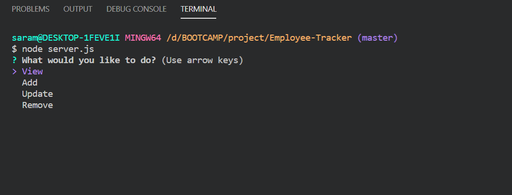
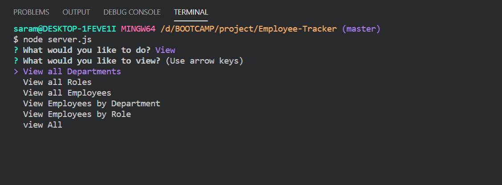
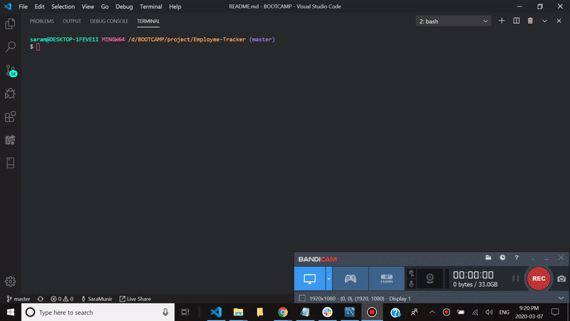
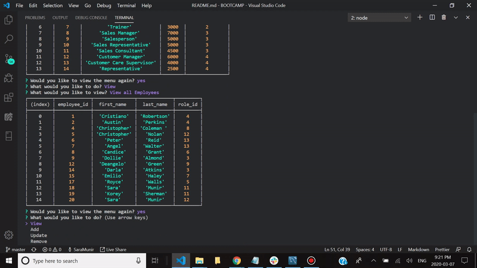
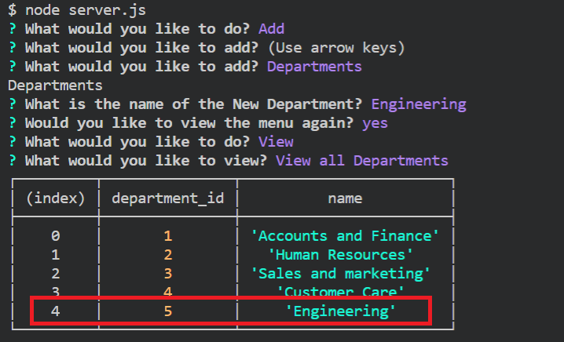
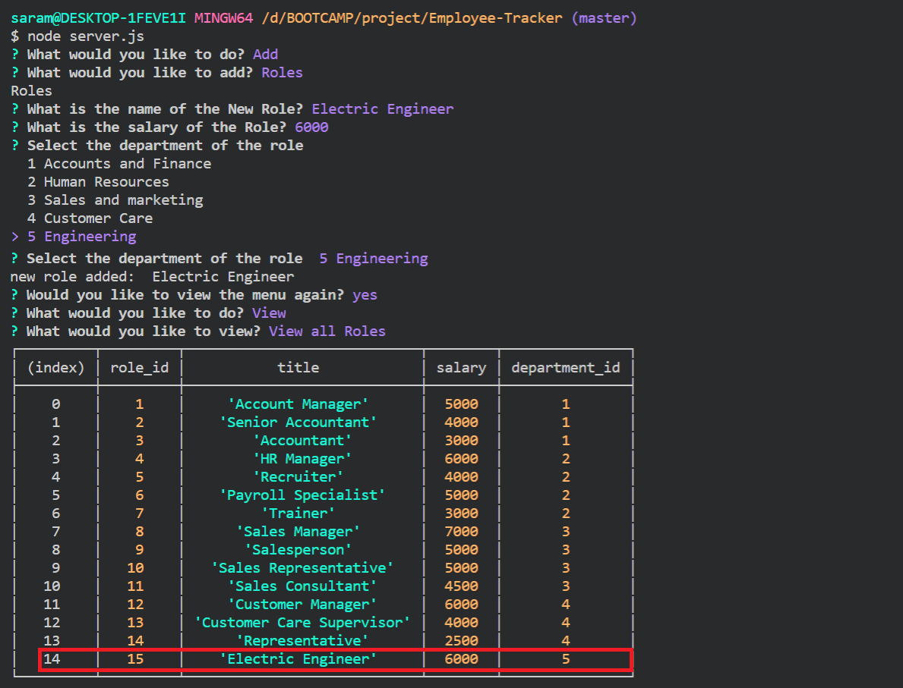
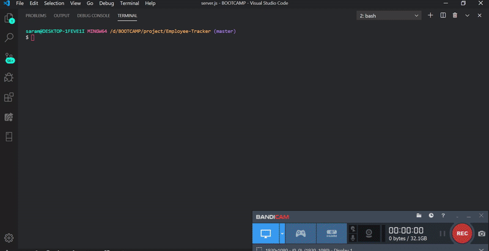
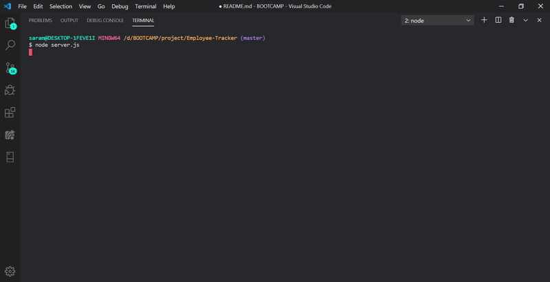
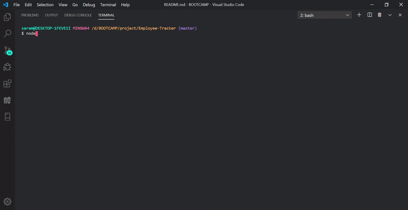

# Employee-Tracker
The objective of the project was to architect and build a solution for managing a company's employees using node, inquirer, and MySQL. The challenge is to build a command-line application that at a minimum allows the user to:

    * Add departments, roles, employees
    * View departments, roles, employees
    * Update employee roles

## Instructions

A database schema containing three tables is created as follows:

## Installation
In order to run the program the following packages has to be installed
    * Inquirer
    * Mysql

## Basic Structure of the application
### Start Menu
The application has four basic options that the user has to choose when it is run. 
* > View
* > Add
* > Update
* > Remove

 

---

## View

Under the view option the user can access the following choices:

    * View all Departments
    * View all Roles
    * View all Employees
    * View Employees by Department
    * View Employees by Role
    * view All

### Example of the view options working

---

## Add 

Under the add option the user can access the following choices:

    * Departments
    * Roles
    * Employees

### Examples
Following are the examples on how each of this options work.

&nbsp;
#### The Add department Scenario

---

&nbsp;
#### The Add role Scenario

---
#### The Add employee Scenario

---
## Update
The update allows the user to edit the roles of employees. 

### Examples
#### The Update employee Scenario

---

## Remove
The remove allows the user to remove department, roles or employees. 
roles can only be delete when there are no employees assigned with that role id. Similarly departments can be only deleted when there are no roles assigned to that particular departmen that needs to be deleted. 
### Examples
#### The Remove employee Scenario

---
